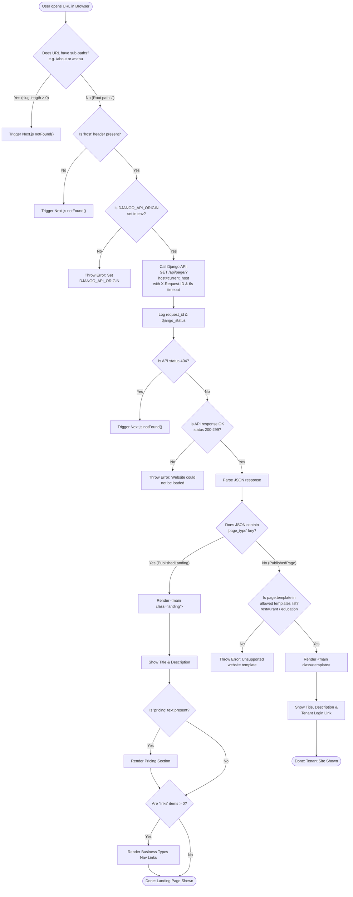

# Next.js Catch-All Route (`app/[[...slug]]/page.tsx`) - Request & Render Flow

```mermaid
flowchart TD
    Start(["User opens URL in Browser"]) --> CheckSlug{"Does URL have sub-paths?<br/>e.g. /about or /menu"}
    
    %% Slug Check
    CheckSlug -- "Yes (slug.length > 0)" --> NotFound1["Trigger Next.js notFound()"]
    CheckSlug -- "No (Root path '/')" --> CheckHost{"Is 'host' header present?"}
    
    %% Host & Env Check
    CheckHost -- No --> NotFound2["Trigger Next.js notFound()"]
    CheckHost -- Yes --> CheckEnv{"Is DJANGO_API_ORIGIN<br/>set in env?"}
    CheckEnv -- No --> ErrEnv["Throw Error: Set DJANGO_API_ORIGIN"]
    
    %% API Call
    CheckEnv -- Yes --> FetchAPI["Call Django API:<br/>GET /api/page/?host=current_host<br/>with X-Request-ID & 6s timeout"]
    FetchAPI --> LogStatus["Log request_id & django_status"]
    LogStatus --> Check404{"Is API status 404?"}
    
    %% API Response Handling
    Check404 -- Yes --> NotFound3["Trigger Next.js notFound()"]
    Check404 -- No --> CheckOK{"Is API response OK<br/>status 200-299?"}
    CheckOK -- No --> ErrLoad["Throw Error: Website could not be loaded"]
    
    %% Data Polymorphism Branching
    CheckOK -- Yes --> ParseJSON["Parse JSON response"]
    ParseJSON --> CheckPageType{"Does JSON contain<br/>'page_type' key?"}
    
    %% Branch A: Landing Page (Platform or Business)
    CheckPageType -- "Yes (PublishedLanding)" --> RenderLanding["Render &lt;main class='landing'&gt;"]
    RenderLanding --> LandingHeader["Show Title & Description"]
    LandingHeader --> CheckPricing{"Is 'pricing' text present?"}
    CheckPricing -- Yes --> ShowPricing["Render Pricing Section"]
    CheckPricing -- No --> CheckLinks
    ShowPricing --> CheckLinks{"Are 'links' items > 0?"}
    CheckLinks -- Yes --> ShowLinks["Render Business Types Nav Links"]
    CheckLinks -- No --> EndLanding(["Done: Landing Page Shown"])
    ShowLinks --> EndLanding
    
    %% Branch B: Tenant Website
    CheckPageType -- "No (PublishedPage)" --> CheckTemplate{"Is page.template in<br/>allowed templates list?<br/>restaurant / education"}
    CheckTemplate -- No --> ErrTemplate["Throw Error: Unsupported website template"]
    CheckTemplate -- Yes --> RenderTenant["Render &lt;main class=template&gt;"]
    RenderTenant --> TenantContent["Show Title, Description &<br/>Tenant Login Link"]
    TenantContent --> EndTenant(["Done: Tenant Site Shown"])
```
